<div align="center">

# Lens: Rethinking Training Efficiency for Foundational Text-to-Image Models


<p>
  <b>Contributors (Alphabetical Order):</b><br />
    <strong>Baining Guo</strong>,
    <strong>Chong Luo</strong>,
    <strong>Dong Chen</strong>&dagger;,
    <strong>Dongdong Chen</strong>,
    <strong>Fangyun Wei</strong>&dagger;,
    <strong>Ji Li</strong>,
    <strong>Jianmin Bao</strong>,
    <strong>Jiawei Zhang</strong>&ast;,
    <strong>Jinjing Zhao</strong>&ast;,
    <strong>Lei Shi</strong>,
    <strong>Qinhong Yang</strong>,
    <strong>Sirui Zhang</strong>&ast;,
    <strong>Xiuyu Wu</strong>,
    <strong>Xuelu Feng</strong>,
    <strong>Yan Lu</strong>,
    <strong>Yanchen Dong</strong>,
    <strong>Yang Yue</strong>&ast;,
    <strong>Yitong Wang</strong>,
    <strong>Yunuo Chen</strong>,
    <strong>Zhiyang Liang</strong>&ast;,
    <strong>Ziyu Wan</strong>&dagger;
  <br />
  Microsoft &nbsp;|&nbsp; &ast;Core Contributors &nbsp;|&nbsp; &dagger;Project Lead
</p>

<p>
  <a href="https://arxiv.org/abs/2605.21573"></a>
  &nbsp;
  <a href="https://huggingface.co/microsoft/Lens"></a>
  &nbsp;
  <a href="https://github.com/microsoft/Lens"></a>
  &nbsp;
  <a href="LICENSE"></a>
</p>

</div>

---

**Lens** is a **3.8B-parameter** foundational text-to-image model designed for **efficient training** and **fast high-resolution generation**. It combines dense-caption pre-training, mixed-resolution learning, GPT-OSS multi-layer text features, and the FLUX.2 semantic VAE to reach competitive quality with substantially less training compute than larger T2I models.

This repository provides the minimal inference code for generating images from Lens DiT checkpoints.

## Highlights

- **Efficient Foundation** &mdash; Trained on **Lens-800M**, an 800M image-text corpus with long GPT-4.1 captions, maximizing information density per training batch.
- **Compact & Expressive** &mdash; A 48-block MMDiT denoiser leverages FLUX.2 latents and concatenated multi-layer GPT-OSS features for stronger prompt following and multilingual generalization.
- **Flexible Resolution** &mdash; Mixed-resolution training enables inference across aspect ratios from `1:2` to `2:1` and resolutions up to **1440&times;1440**.
- **Post-trained Variants** &mdash; RL tuning improves visual quality and artifact suppression; the distilled **Lens-Turbo** supports fast **4-step** generation.

## Gallery

<!-- LENS_GALLERY_START -->

<details name="lens-gallery" open>
  <summary><b>Page 1 / 6</b> &nbsp; samples 000-005</summary>

<table>
  <tr>
    <td width="33%" valign="top">
      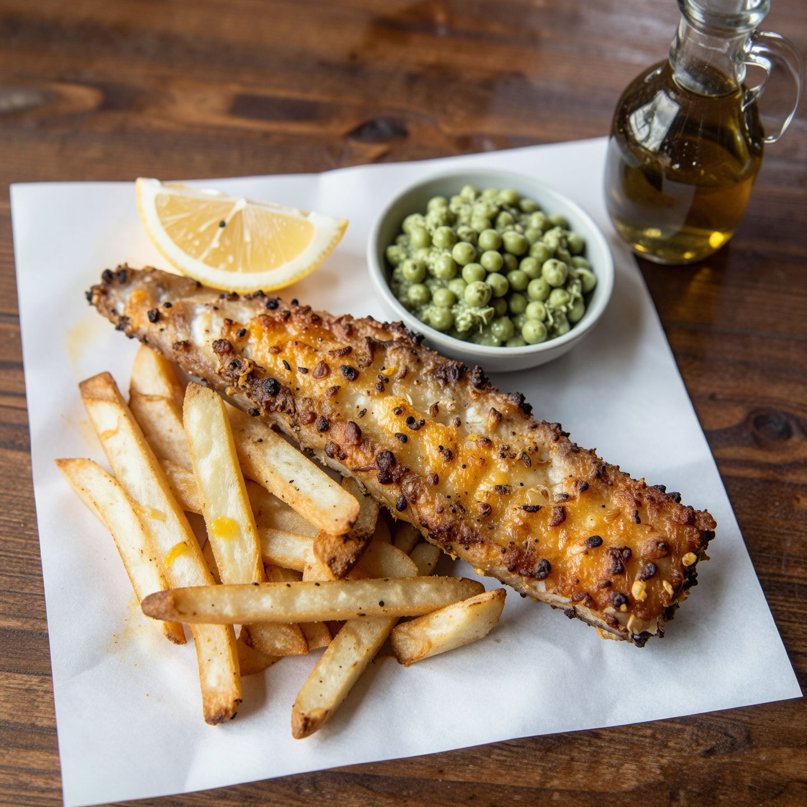
      <br />
      <sub><b>Sample 000</b> &middot; 1440x1440<br />A generous portion of classic British fish and chips served on a sheet of white paper, golden crispy beer-battered cod fillet alongside thick-cut chips, a wedge of lemon, mushy peas in a small dish, malt vinegar bottle nearby, wooden pub table, overhead shot</sub>
    </td>
    <td width="33%" valign="top">
      
      <br />
      <sub><b>Sample 001</b> &middot; 1440x1440<br />The iconic Big Ben clock tower and the Houses of Parliament in London at golden hour, the River Thames reflecting warm amber light, Westminster Bridge in the foreground, a classic red double-decker bus crossing, dramatic clouds lit by sunset</sub>
    </td>
    <td width="33%" valign="top">
      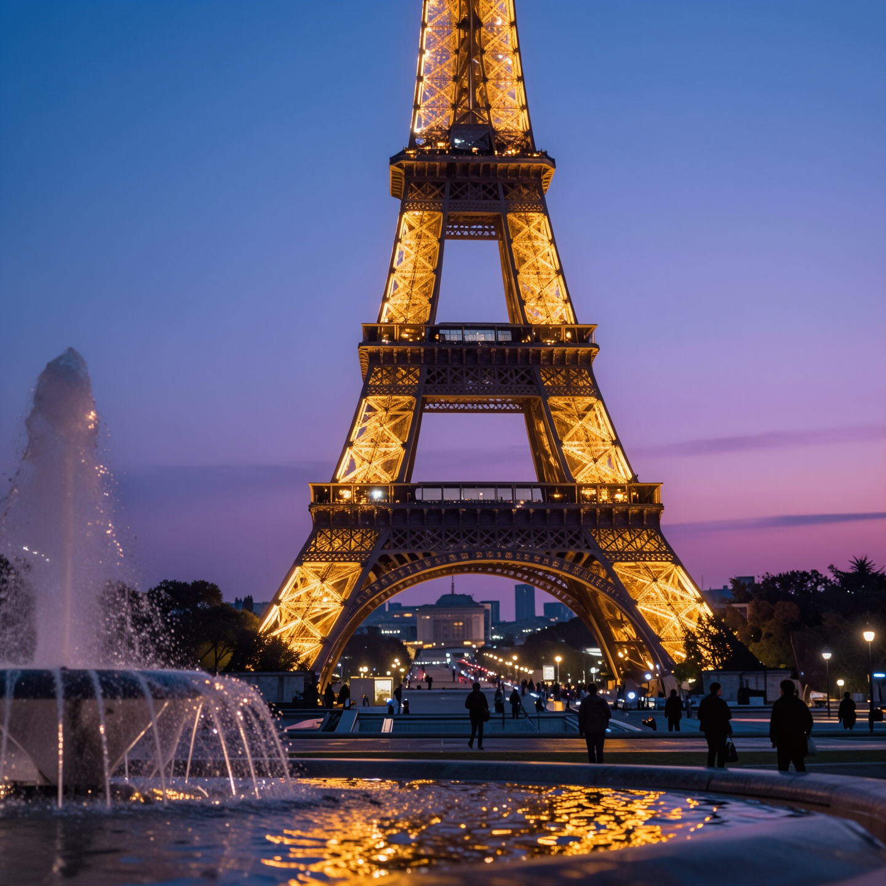
      <br />
      <sub><b>Sample 002</b> &middot; 1440x1440<br />La Tour Eiffel au cr&#233;puscule vue depuis le Trocad&#233;ro, la structure en fer illumin&#233;e de milliers de lumi&#232;res dor&#233;es scintillantes, le ciel passant du bleu profond au violet, les fontaines du Trocad&#233;ro au premier plan avec des reflets dor&#233;s, silhouettes de promeneurs</sub>
    </td>
  </tr>
  <tr>
    <td width="33%" valign="top">
      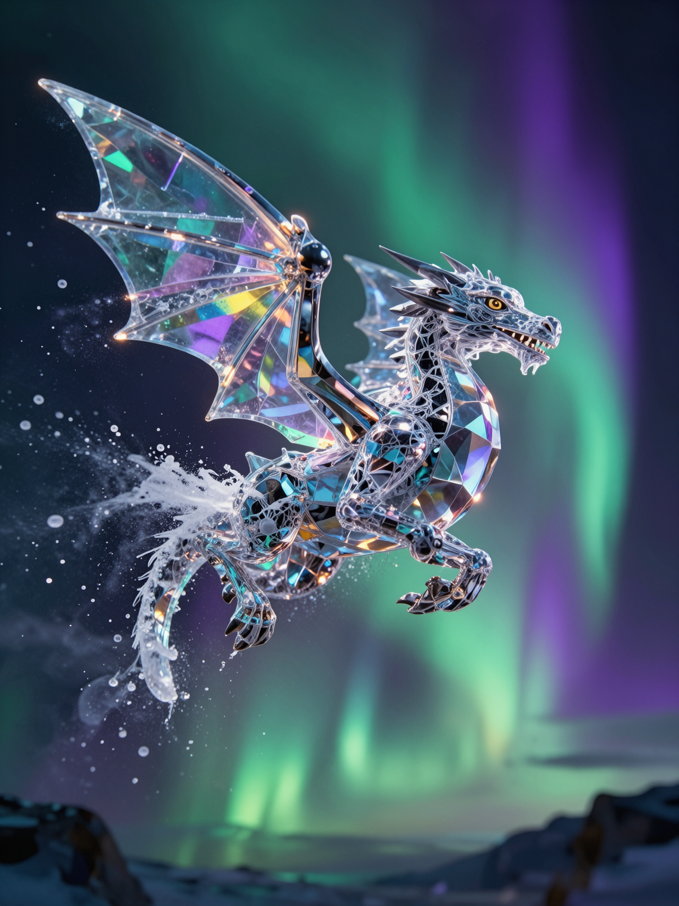
      <br />
      <sub><b>Sample 003</b> &middot; 1248x1664<br />A crystal dragon soaring through an aurora borealis sky, its entire body made of transparent faceted crystal refracting the green and purple aurora light into rainbow spectra, ice particles trailing from its wings, high fantasy digital art</sub>
    </td>
    <td width="33%" valign="top">
      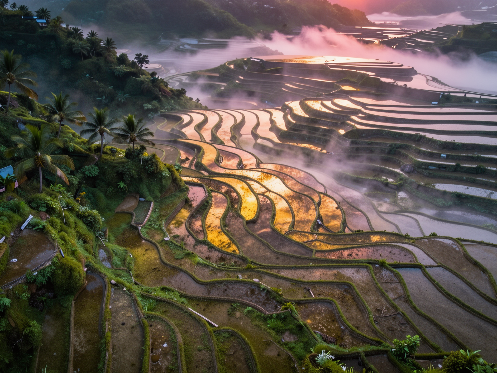
      <br />
      <sub><b>Sample 004</b> &middot; 1664x1248<br />Aerial view of Yuanyang rice terraces in Yunnan province at sunrise, thousands of cascading water-filled paddies reflecting golden and pink sky colors, morning mist weaving between terrace layers, lush green hillside with scattered palm trees, drone photography</sub>
    </td>
    <td width="33%" valign="top">
      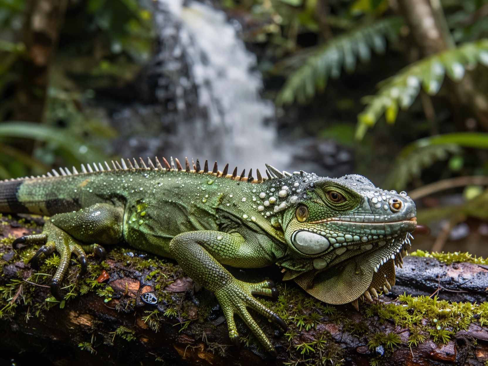
      <br />
      <sub><b>Sample 005</b> &middot; 1664x1248<br />A green iguana basking on a moss-covered fallen log in a tropical rainforest, every scale and spine rendered in sharp detail, dewdrops clinging to its skin, a blurred waterfall and lush tropical foliage in the background, National Geographic wildlife photography style</sub>
    </td>
  </tr>
</table>
</details>

<details name="lens-gallery">
  <summary><b>Page 2 / 6</b> &nbsp; samples 006-011</summary>

<table>
  <tr>
    <td width="33%" valign="top">
      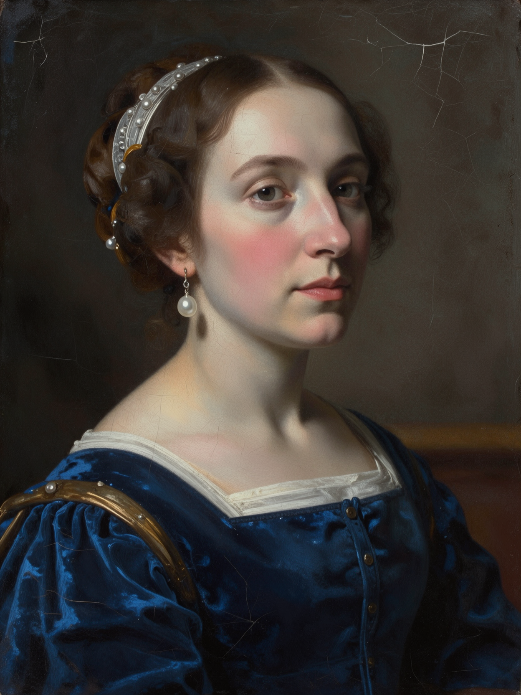
      <br />
      <sub><b>Sample 006</b> &middot; 1248x1664<br />Oil painting portrait of a Renaissance noblewoman in a deep blue velvet dress with pearl drop earrings, soft chiaroscuro lighting revealing delicate skin, craquelure texture on the painted surface, in the style of Vermeer</sub>
    </td>
    <td width="33%" valign="top">
      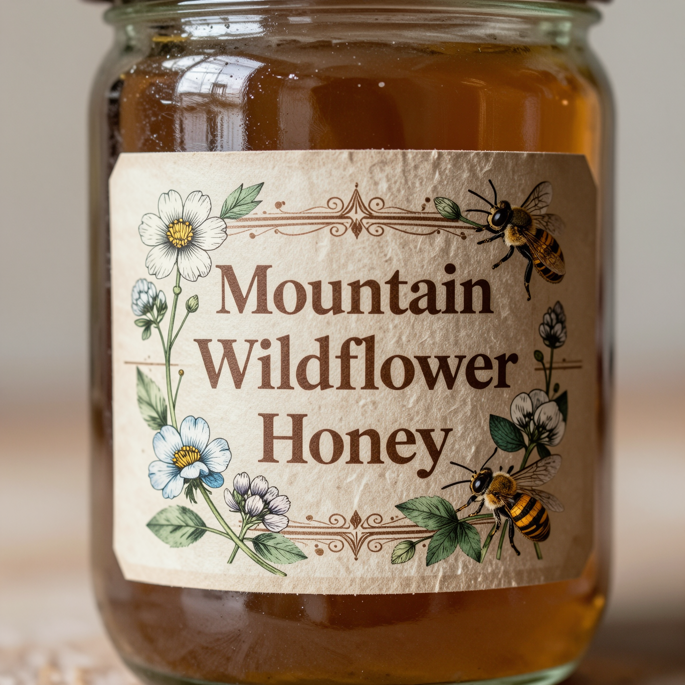
      <br />
      <sub><b>Sample 007</b> &middot; 1440x1440<br />An artisan honey jar with a hand-illustrated vintage botanical label reading &quot;Mountain Wildflower Honey&quot; in brown serif letterpress-style typography with decorative flourishes, detailed ink drawings of wildflowers, clover and honeybees surrounding the text, kraft paper label on clear glass jar</sub>
    </td>
    <td width="33%" valign="top">
      
      <br />
      <sub><b>Sample 008</b> &middot; 1440x1440<br />Watercolor portrait of a thoughtful young man reading a worn leather book in a Parisian cafe, loose wet-on-wet brushstrokes bleeding into warm amber and burnt sienna washes, visible paper grain texture</sub>
    </td>
  </tr>
  <tr>
    <td width="33%" valign="top">
      
      <br />
      <sub><b>Sample 009</b> &middot; 1664x1248<br />An explorer&#x27;s oak desk with an aged world map spread open, a brass sextant, leather-bound navigation journal with handwritten entries, melting candle in a copper holder, scattered compass and quill pen, warm window light, still life photography</sub>
    </td>
    <td width="33%" valign="top">
      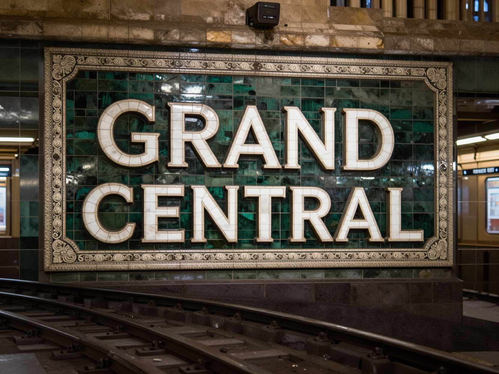
      <br />
      <sub><b>Sample 010</b> &middot; 1664x1248<br />New York Grand Central Terminal subway station with the classic station name &quot;GRAND CENTRAL&quot; spelled out in elegant white ceramic mosaic tile letters embedded in a dark green tile wall, each letter approximately eight inches tall, ornate tile border frames, the S-curve of train tracks visible</sub>
    </td>
    <td width="33%" valign="top">
      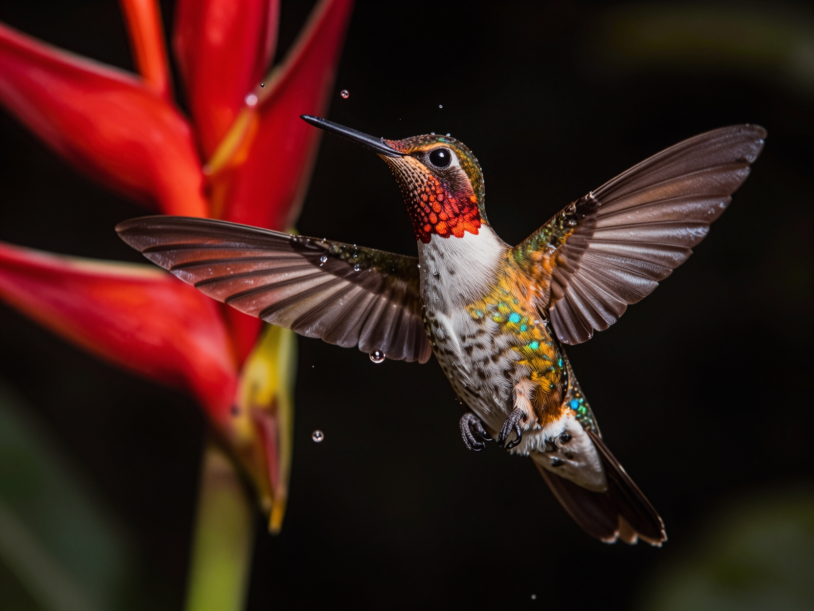
      <br />
      <sub><b>Sample 011</b> &middot; 1664x1248<br />A ruby-throated hummingbird hovering in front of a bright red heliconia flower, wings frozen in a figure-eight pattern showing iridescent feather detail, individual water droplets suspended around the bird, high-speed macro photography with dark background</sub>
    </td>
  </tr>
</table>
</details>

<details name="lens-gallery">
  <summary><b>Page 3 / 6</b> &nbsp; samples 012-017</summary>

<table>
  <tr>
    <td width="33%" valign="top">
      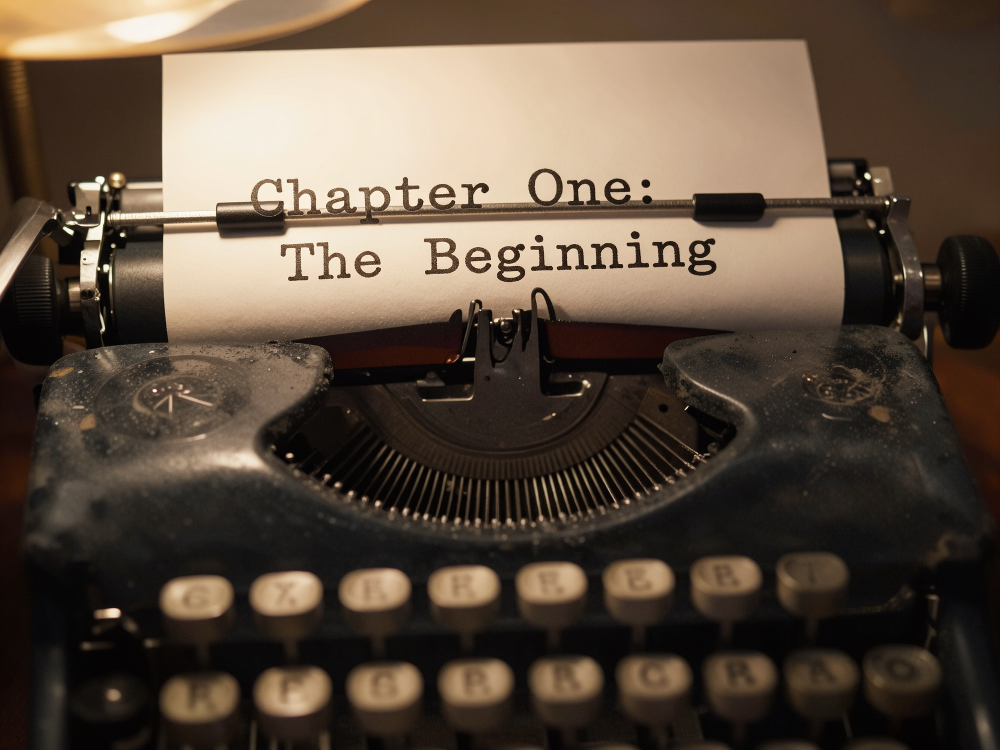
      <br />
      <sub><b>Sample 012</b> &middot; 1664x1248<br />An old Remington typewriter with a sheet of cream-colored paper rolled into the carriage, the typed words &quot;Chapter One: The Beginning&quot; visible in slightly uneven Courier typeface with characteristic ink density variations, some letters slightly misaligned, warm desk lamp lighting</sub>
    </td>
    <td width="33%" valign="top">
      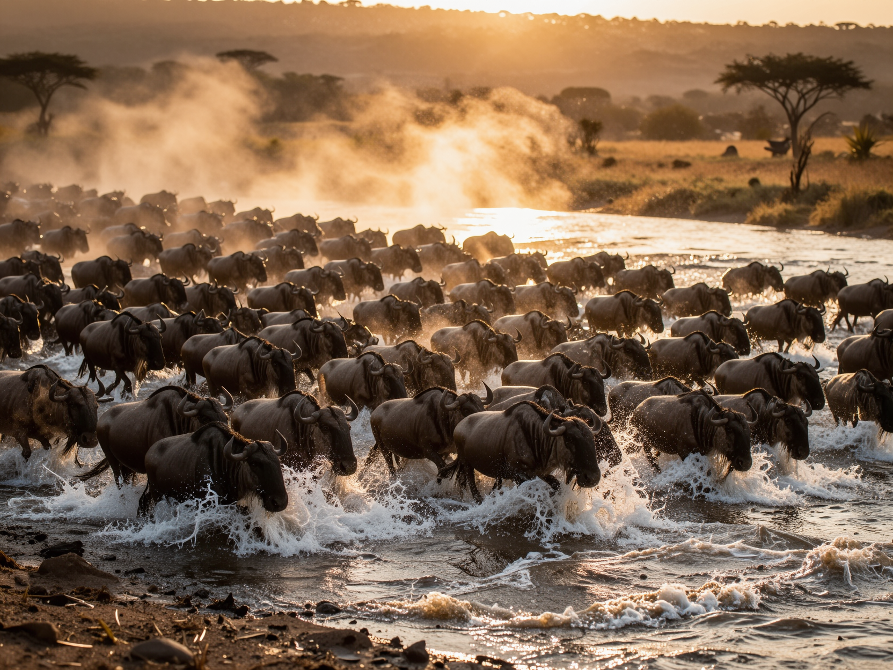
      <br />
      <sub><b>Sample 013</b> &middot; 1664x1248<br />The Great Wildebeest Migration crossing the Mara River at golden hour, hundreds of animals plunging into churning water sending spray everywhere, dust clouds rising from the riverbank, dramatic backlit scene, National Geographic documentary style</sub>
    </td>
    <td width="33%" valign="top">
      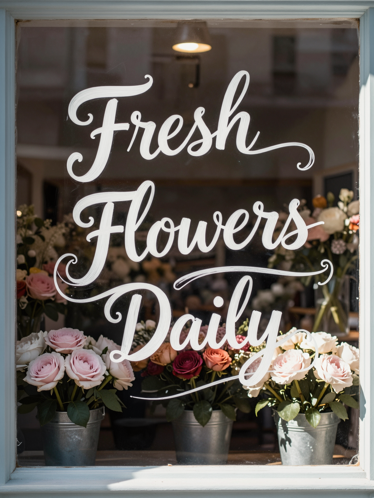
      <br />
      <sub><b>Sample 014</b> &middot; 1248x1664<br />A charming flower shop storefront window with hand-painted white script lettering on the glass reading &quot;Fresh Flowers Daily&quot; in flowing connected cursive with decorative swashes, roses and peonies arranged in buckets visible through the lettering, morning sunlight catching the painted letters</sub>
    </td>
  </tr>
  <tr>
    <td width="33%" valign="top">
      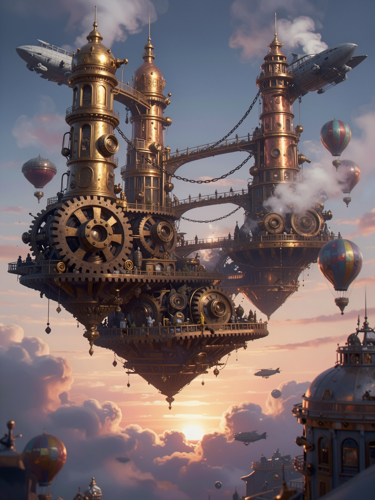
      <br />
      <sub><b>Sample 015</b> &middot; 1248x1664<br />A steampunk floating sky-city built on massive gear-driven platforms, brass and copper towers connected by chain bridges, steam-powered airships and hot air balloons docking at various levels, sunset clouds below the city, detailed concept art</sub>
    </td>
    <td width="33%" valign="top">
      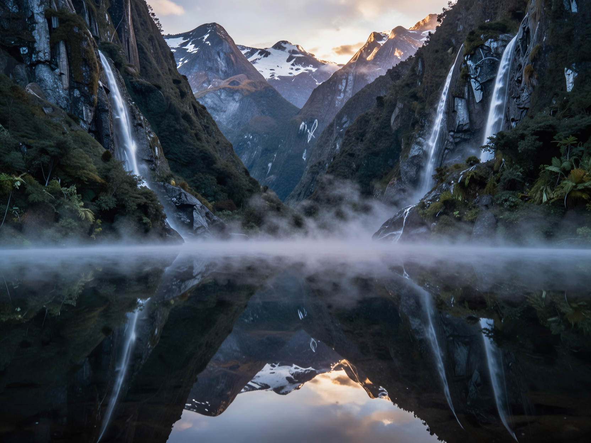
      <br />
      <sub><b>Sample 016</b> &middot; 1664x1248<br />Milford Sound in New Zealand at dawn, a perfect mirror reflection of steep fjord walls on glass-still water, waterfalls streaming down thousand-foot cliffs, morning mist hovering above the water surface, panoramic landscape photography</sub>
    </td>
    <td width="33%" valign="top">
      
      <br />
      <sub><b>Sample 017</b> &middot; 1248x1664<br />An Indian Bharatanatyam classical dancer in the aramandi pose, bronze ankle bells and elaborate hand mudra gestures, rich silk costume with gold temple jewelry, captured mid-performance with dramatic stage lighting</sub>
    </td>
  </tr>
</table>
</details>

<details name="lens-gallery">
  <summary><b>Page 4 / 6</b> &nbsp; samples 018-023</summary>

<table>
  <tr>
    <td width="33%" valign="top">
      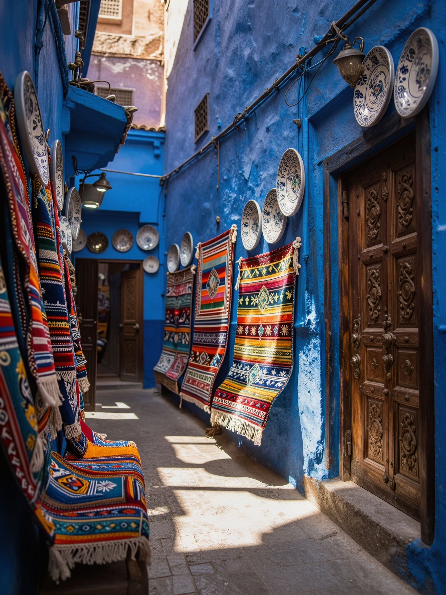
      <br />
      <sub><b>Sample 018</b> &middot; 1248x1664<br />A narrow alleyway in Marrakech&#x27;s old medina with walls painted in vivid cobalt blue, colorful handwoven rugs and ceramic plates displayed along the walls, ornate wooden doors, warm sunlight from above creating dramatic shadows, Moroccan architecture</sub>
    </td>
    <td width="33%" valign="top">
      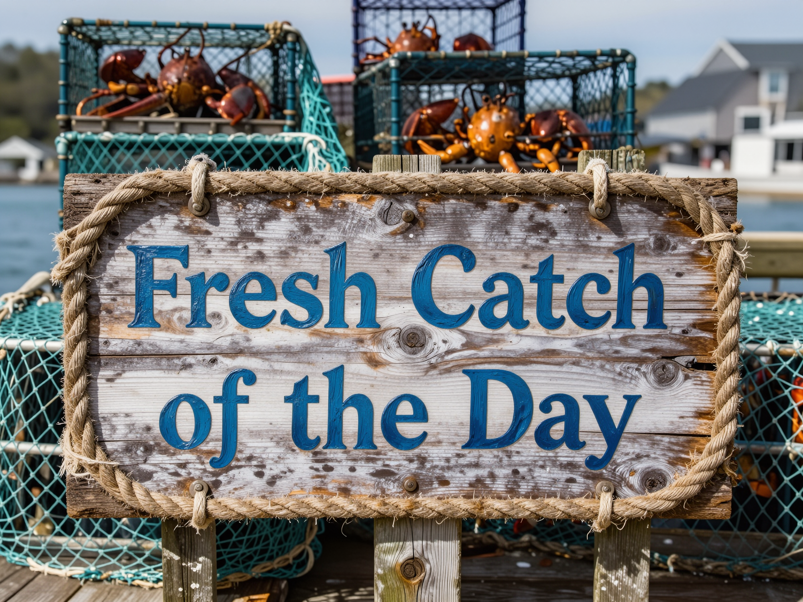
      <br />
      <sub><b>Sample 019</b> &middot; 1664x1248<br />A rustic wooden sign at a fishing village dock reading &quot;Fresh Catch of the Day&quot; in hand-carved letters painted nautical blue, thick hemp rope threaded through the sign as a border, fishing nets and lobster traps stacked in the background, seaside atmosphere</sub>
    </td>
    <td width="33%" valign="top">
      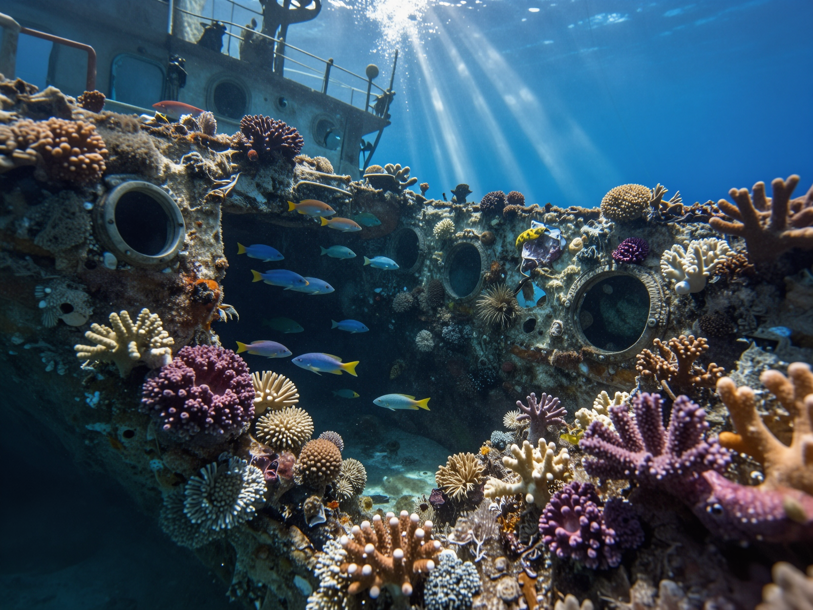
      <br />
      <sub><b>Sample 020</b> &middot; 1664x1248<br />A sunken shipwreck on the ocean floor completely overgrown with colorful coral formations, schools of tropical fish swimming through the broken hull and portholes, shafts of sunlight streaming down from the surface above, underwater archaeology photography</sub>
    </td>
  </tr>
  <tr>
    <td width="33%" valign="top">
      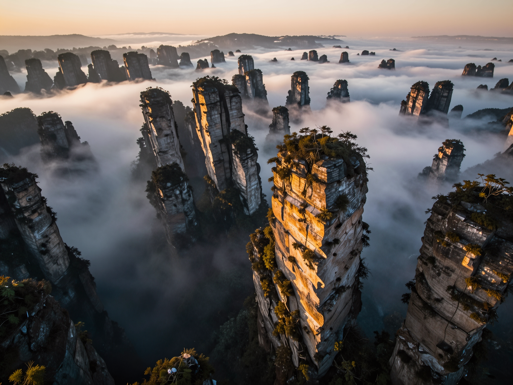
      <br />
      <sub><b>Sample 021</b> &middot; 1664x1248<br />Zhangjiajie pillar mountains rising above a sea of clouds at sunrise, golden light painting the sandstone peaks, the surreal Avatar-like floating mountain landscape stretching to the horizon, aerial drone photography capturing immense vertical scale</sub>
    </td>
    <td width="33%" valign="top">
      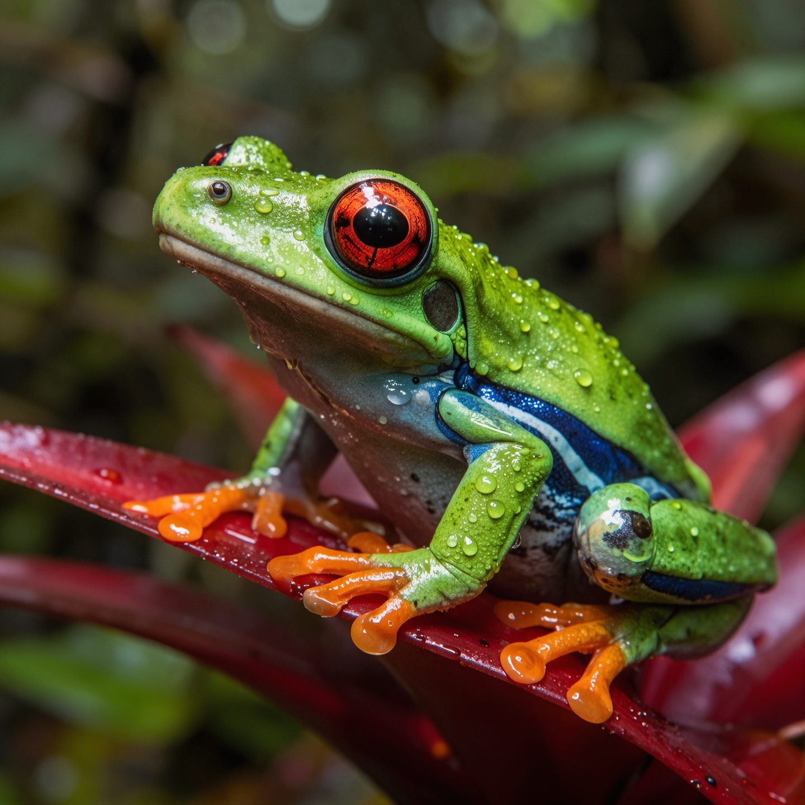
      <br />
      <sub><b>Sample 022</b> &middot; 1440x1440<br />A red-eyed tree frog perched on a bright red bromeliad flower in the Costa Rican cloud forest, its neon green body contrasting with blue-striped flanks and orange feet, water droplets on its smooth skin, extreme macro with ring flash lighting</sub>
    </td>
    <td width="33%" valign="top">
      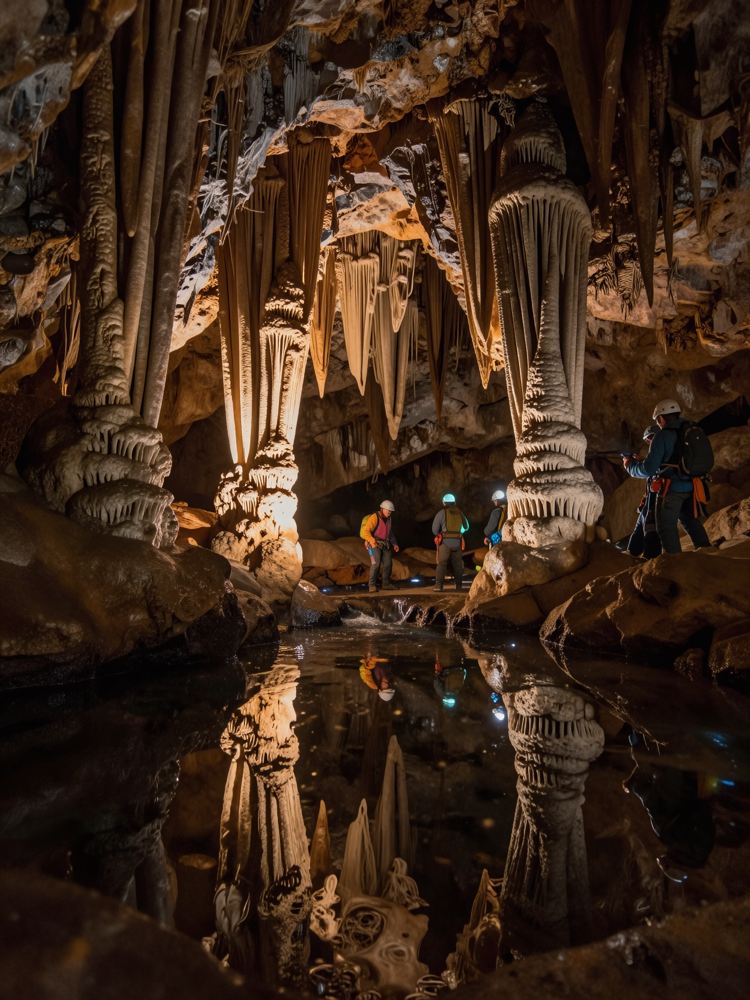
      <br />
      <sub><b>Sample 023</b> &middot; 1248x1664<br />Inside a massive limestone cave, ancient stalactites and stalagmites meeting to form columns, an underground river reflecting the formations like a mirror, subtle warm lighting revealing millions of years of mineral deposits, spelunking exploration photography</sub>
    </td>
  </tr>
</table>
</details>

<details name="lens-gallery">
  <summary><b>Page 5 / 6</b> &nbsp; samples 024-029</summary>

<table>
  <tr>
    <td width="33%" valign="top">
      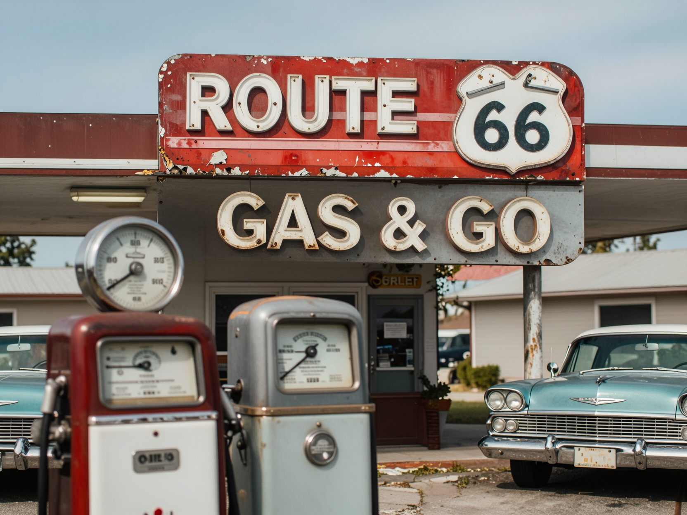
      <br />
      <sub><b>Sample 024</b> &middot; 1664x1248<br />A weathered 1960s gas station with a large roadside sign reading &quot;ROUTE 66 GAS &amp; GO&quot; in retro rounded sans-serif letters with a red and white color scheme, vintage gas pumps with analog dials in the foreground, a classic Chevrolet parked to the side, Americana nostalgia</sub>
    </td>
    <td width="33%" valign="top">
      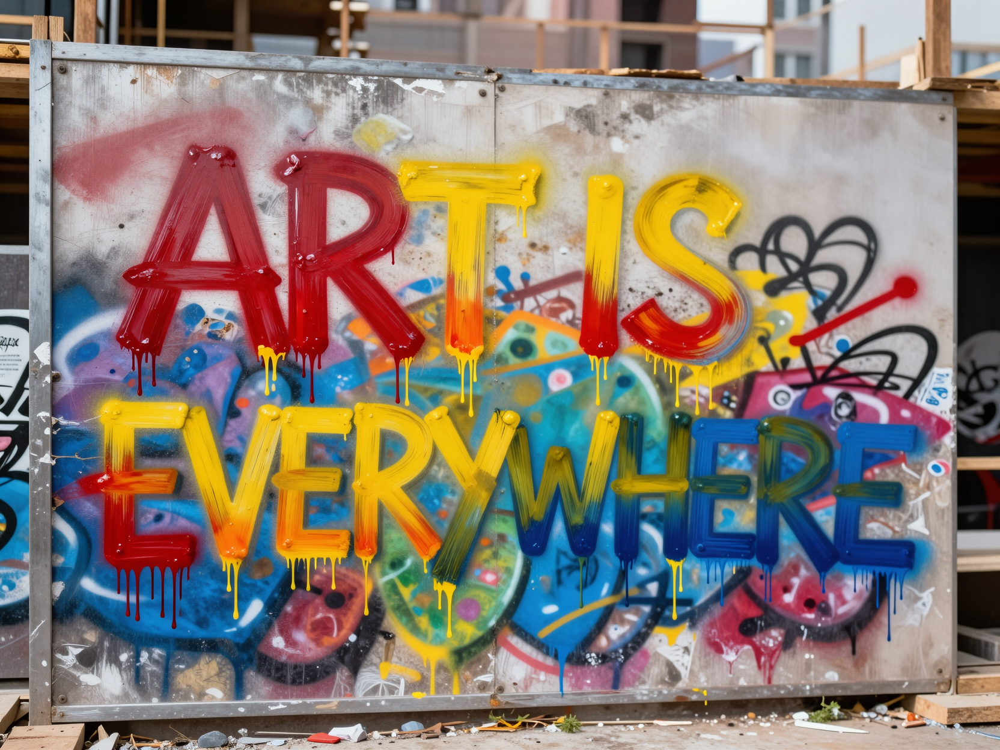
      <br />
      <sub><b>Sample 025</b> &middot; 1664x1248<br />Construction site hoarding covered in unauthorized street art with &quot;ART IS EVERYWHERE&quot; spray-painted in large freehand capital letters using multiple overlapping colors of red, yellow and blue, paint drips running down from each letter, chaotic beautiful urban canvas</sub>
    </td>
    <td width="33%" valign="top">
      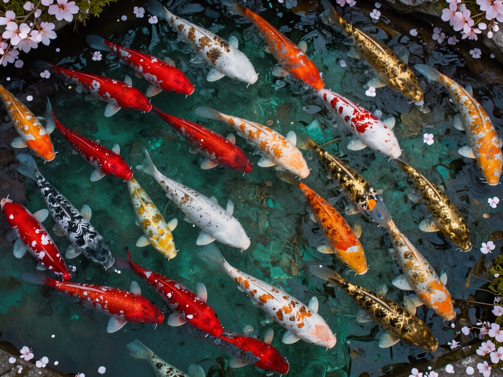
      <br />
      <sub><b>Sample 026</b> &middot; 1664x1248<br />Top-down view of a koi pond, dozens of ornamental koi fish in vivid red white orange and gold patterns swimming through crystal-clear emerald water, fallen cherry blossom petals floating on the surface, Japanese garden aerial photography</sub>
    </td>
  </tr>
  <tr>
    <td width="33%" valign="top">
      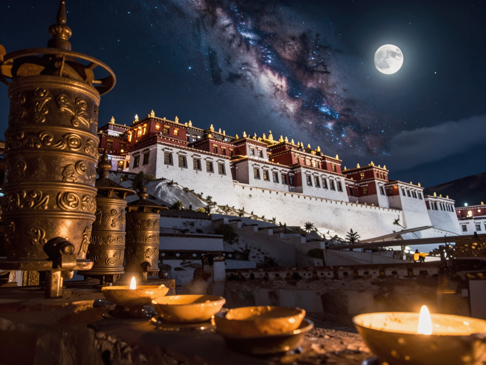
      <br />
      <sub><b>Sample 027</b> &middot; 1664x1248<br />The Potala Palace in Lhasa under a canopy of stars with the Milky Way arching overhead, Tibetan prayer wheels and butter lamps in the foreground casting warm golden light, the massive white and red palace walls glowing in moonlight, night photography</sub>
    </td>
    <td width="33%" valign="top">
      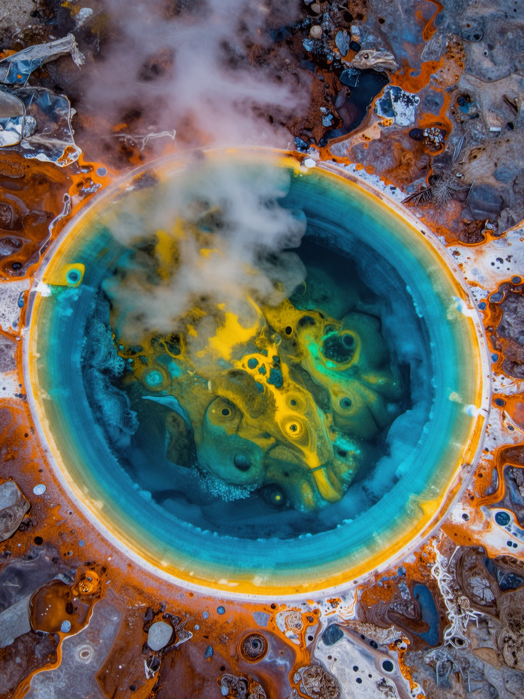
      <br />
      <sub><b>Sample 028</b> &middot; 1248x1664<br />Yellowstone&#x27;s Grand Prismatic Spring shot from directly above by drone, concentric rings of vivid blue turquoise green yellow and orange created by thermophilic bacteria, steam rising from the surface, abstract natural color palette</sub>
    </td>
    <td width="33%" valign="top">
      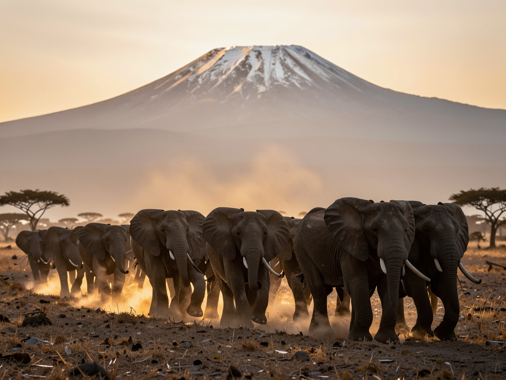
      <br />
      <sub><b>Sample 029</b> &middot; 1664x1248<br />A herd of African elephants walking in a line across the savanna with Mount Kilimanjaro&#x27;s snow-capped peak behind them, golden sunset dust kicked up by their feet creating a hazy atmosphere, telephoto wildlife photography showing massive scale</sub>
    </td>
  </tr>
</table>
</details>

<details name="lens-gallery">
  <summary><b>Page 6 / 6</b> &nbsp; samples 030-031</summary>

<table>
  <tr>
    <td width="33%" valign="top">
      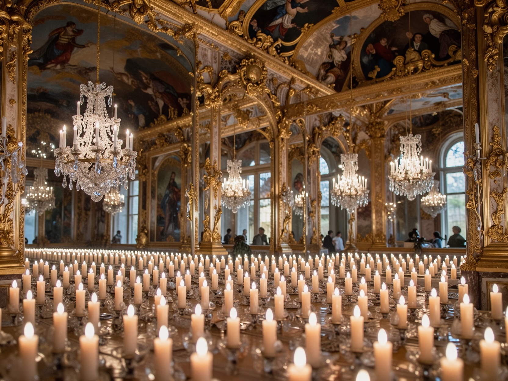
      <br />
      <sub><b>Sample 030</b> &middot; 1664x1248<br />The Hall of Mirrors at the Palace of Versailles, hundreds of candles reflected infinitely in the massive gilded mirrors, crystal chandeliers casting prismatic light across painted ceilings and gold leaf ornamentation, Baroque opulence</sub>
    </td>
    <td width="33%" valign="top">
      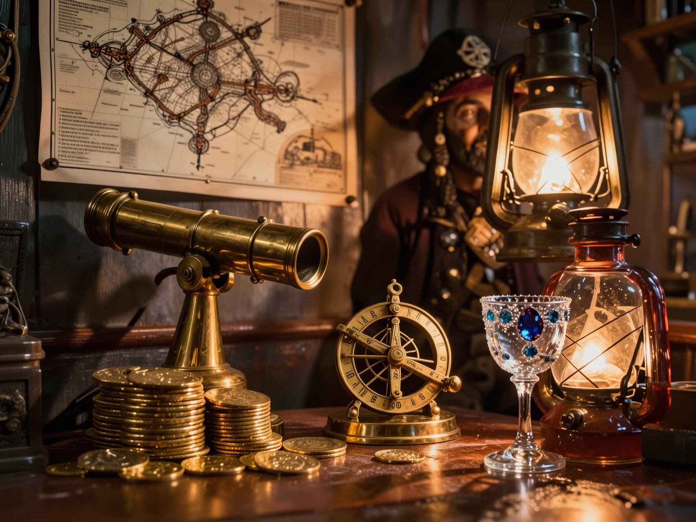
      <br />
      <sub><b>Sample 031</b> &middot; 1664x1248<br />A pirate captain&#x27;s cabin, navigation charts pinned to the wall, a brass telescope and astrolabe on the desk, stacks of gold coins and a jewel-encrusted goblet, rum bottle, warm swinging lantern light casting shadows with the ship&#x27;s motion</sub>
    </td>
    <td width="33%"></td>
  </tr>
  <tr>
    <td width="33%"></td>
    <td width="33%"></td>
    <td width="33%"></td>
  </tr>
</table>
</details>
<!-- LENS_GALLERY_END -->

## Installation

> **Tested environment:** Python 3.12 &middot; CUDA 12.6 &middot; PyTorch 2.11.0+cu126 &middot; TorchVision 0.26.0+cu126

```bash
conda create -n lens python=3.12 -y
conda activate lens

uv pip install torch==2.11.0+cu126 torchvision==0.26.0+cu126 \
    --index-url https://download.pytorch.org/whl/cu126
uv pip install -r requirements.txt
```

The default GPT-OSS encoder and FLUX.2 VAE are loaded from Hugging Face. Make sure your environment has access to any gated model repositories you use.

## Checkpoints

| Repo | Description | Steps | CFG |
| :--- | :--- | :---: | :---: |
| [`microsoft/Lens`](https://huggingface.co/microsoft/Lens) | **Default.** RL-tuned for visual quality | 20 | 5.0 |
| [`microsoft/Lens-Turbo`](https://huggingface.co/microsoft/Lens-Turbo) | Distilled from the RL model for fast 4-step sampling | 4 | 1.0 |
| [`microsoft/Lens-Base`](https://huggingface.co/microsoft/Lens-Base) | Supervised base model (no RL, no distillation) | 50 | 5.0 |

Pick a variant by passing its repo id to `--repo_id` (CLI) or `LensPipeline.from_pretrained(...)` (Python).

## Inference

> **Important:** run from the cloned repo root so `from lens import LensPipeline` resolves to this package &mdash; importing `lens` is what registers `LensGptOssEncoder` / `LensTransformer2DModel` with the `transformers` and `diffusers` namespaces that `model_index.json` references.

**Python API:**

```python
import torch
from lens import LensPipeline

pipe = LensPipeline.from_pretrained(
    "microsoft/Lens", torch_dtype=torch.bfloat16
).to("cuda")

image = pipe(
    prompt="A cat holding a sign that says \"hello world\"",
    base_resolution=1440, aspect_ratio="1:1",
    num_inference_steps=20, guidance_scale=5.0,
    generator=torch.Generator("cuda").manual_seed(0),
).images[0]
image.save("lens.png")
```

To trade speed for VRAM, replace `.to("cuda")` with `pipe.enable_model_cpu_offload()`.

**CLI &mdash; basic usage:**

```bash
python inference.py \
    --repo_id "microsoft/Lens" \
    --prompt "A cinematic mountain lake at sunrise, soft mist, detailed reflections" \
    --base_resolution 1440 --aspect_ratio 1:1 \
    --steps 20 --cfg 5.0 --n 1 --seed 42 \
    --out ./outputs
```

**Batch generation** &mdash; join multiple prompts with `|`:

```bash
python inference.py \
    --repo_id "microsoft/Lens" \
    --steps 20 --cfg 5.0 \
    --prompt "a red fox in snow|a glass greenhouse at night"
```

**A100 / V100 (no MXFP4 kernels)** &mdash; dequantize the GPT-OSS encoder to bf16:

```bash
python inference.py \
    --repo_id "microsoft/Lens" \
    --steps 20 --cfg 5.0 \
    --prompt "a cat" \
    --disable_mxfp4 --offload
```

### Options

| Flag | Description | Default |
| :--- | :--- | :--- |
| `--repo_id` | HF repo id (or local path) of the assembled Lens pipeline | `microsoft/Lens` |
| `--base_resolution` | `1024` or `1440` | `1440` |
| `--aspect_ratio` | `1:2`, `9:16`, `2:3`, `3:4`, `1:1`, `4:3`, `3:2`, `16:9`, `2:1` | `1:1` |
| `--steps` | Number of denoising steps | `20` |
| `--cfg` | Classifier-free guidance scale | `5.0` |
| `--n` | Number of images per prompt | `1` |
| `--seed` | Random seed (omit for non-deterministic) | &mdash; |
| `--out` | Output directory | `./outputs` |
| `--dtype` | Compute dtype: `bfloat16`, `float16`, `float32` | `bfloat16` |
| `--disable_mxfp4` | Dequantize the GPT-OSS text encoder to `--dtype` (required on A100 / V100; Hopper+ keeps MXFP4 by default for less VRAM) | &mdash; |
| `--offload` | Enable diffusers CPU offload (`text_encoder->transformer->vae`) to reduce peak VRAM | &mdash; |
| `--reasoner` | Refine prompts with the loaded GPT-OSS encoder before generation | &mdash; |
| `--api_url` / `--api_key` / `--api_model` | Use an OpenAI-compatible API for prompt refinement (takes precedence over `--reasoner`) | &mdash; |

## Citation

```bibtex
@article{zhao2026lens,
  title   = {Lens: Rethinking Training Efficiency for Foundational Text-to-Image Models},
  author  = {Guo, Baining and Luo, Chong and Chen, Dong and Chen, Dongdong and Wei, Fangyun and Li, Ji and Bao, Jianmin and Zhang, Jiawei and Zhao, Jinjing and Shi, Lei and Yang, Qinhong and Zhang, Sirui and Wu, Xiuyu and Feng, Xuelu and Lu, Yan and Dong, Yanchen and Yue, Yang and Wang, Yitong and Chen, Yunuo and Liang, Zhiyang and Wan, Ziyu},
  journal = {arXiv preprint arXiv:2605.21573},
  year    = {2026}
}
```

## Responsible AI

The model is released for research purposes only and is not intended for product or service deployment. Responsible AI considerations were incorporated throughout the development process, including data selection, model training, and evaluation.
The training data includes a combination of public, licensed, and internal datasets that were processed to remove clearly identifiable personal information and reduce harmful content where possible. However, as the data is largely sourced from web-scale collections, it may contain biases or uneven representation. As a result, the model may generate outputs that are inaccurate, biased, or inappropriate under certain prompts, including content that could be misleading or raise copyright or IP-related concerns.
Given these limitations, the model should be used in controlled research settings, with appropriate human oversight. Downstream users are responsible for applying additional safeguards, such as content moderation, validation, and compliance checks, before using the model in broader applications.

## Privacy

This project does not collect any usage data. For more information, see the [Microsoft Privacy Statement](https://go.microsoft.com/fwlink/?LinkId=521839).

## License

This project is released under the [MIT License](LICENSE).
